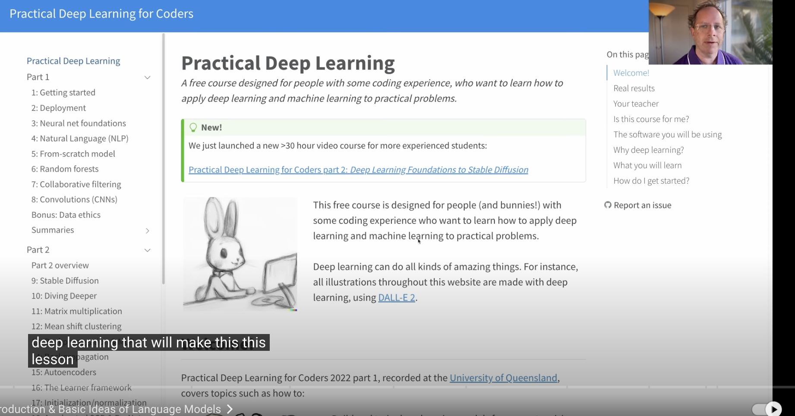
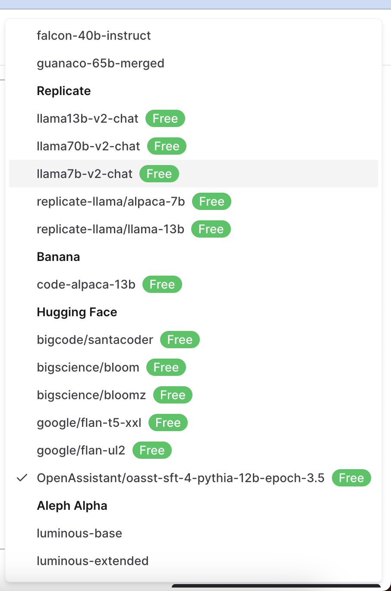
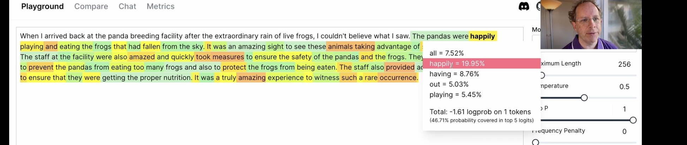

# A_Hackers_Guide_to_Language_Models_Jeremy_howard

- this repo follows the video https://www.youtube.com/watch?v=jkrNMKz9pWU

- This is a guide to language models, from basic n-grams through to the current sequence-to-sequence models used in cutting edge research.

- Who is Jeremy Howard?
    - Jeremy Howard is an Australian data scientist and entrepreneur. He is the founder of Fast.ai, a research institute dedicated to make deep learning more accessible. He is also a faculty member at the University of San Francisco, the University of Washington, and Singularity University. He was the founding CEO of Enlitic, which was the first company to apply deep learning to medicine, and which was selected as one of the world's top 50 smartest companies by MIT Tech Review two years running. He was previously the President and Chief Scientist of the data science platform Kaggle, where he was the top ranked participant in international machine learning competitions 2 years running. He was the founding CEO of two successful Australian startups (FastMail, and Optimal Decisions Group--purchased by Lexis-Nexis). Before that, he spent 8 years in management consulting, at McKinsey & Co, and AT Kearney. He lives in San Francisco.

- The name Hackers Guide is inspired by the book "A Hackers Guide to Neural Language Models" by Yoav Goldberg, which is a great resource for those who want to go deeper into the theory behind language models.

- Here this is a code first approach, to understanding how to use Language Models in practice,

- So what is a language model?
    - A language model is a model that learns to predict the probability of a sequence of words, such as a sentence.
    - or a sequence of words, such as a sentence.
    - https://course.fast.ai/
        - the above link is a course by Jeremy Howard, which is a great resource for learning deep learning, and machine learning in general. 
        - This course is a great resource for learning how to use language models in practice.
        

- This video is mostly a runthrough than a tutorial, so if you want to learn how to use language models in practice, check out the fast.ai course. 

- https://nat.dev/
    - This is a great resource for learning how to use language models in practice.
    - juxt sign in and u can use lots of free models.
    - 
    - to use the models, just type in the text, and the model will generate the text for you.
    - just sign up for the newsletter, and you will get a free course on how to use language models in practice.
    - the text-davinci-003 model is the best model, and it is the most expensive model, so it is not free.

- here he is using the text-davinci-003 model, and it is generating the text for him.
- the model is generating the text based on the text that he has given it., also it picks the words based on the probability of the words.
- at each step, the model is picking the next word based on the probability of the word.

- we can set the temperature of the model, which is the randomness of the model.
- the lower the temperature, the less random the model is.
- the higher the temperature, the more random the model is.

- The ULMFiT 3 step approach
    - the idea of what chatgpt or bard is doing is,
    - step 1
        - LM training (Pre training)
            - this predicts the next word of the sentence
            - he traine a NN to predict the next word of the sentence, using Wikipedia data.
        - LM fine tuning (Pre training)
            - we are no longer giving it all wiki, instead large chunk of internet data.
            - in the fine tuning stage, we feed it a set of documents, a lot closer to the final task that we want to do., But still its the same idea of predict the next word of a sentence, 

        - Classifier fine tuning 
            - this is the final task we want to do,
            - Now a days very specific approachs are taken for step two and three.
            - They do something called Instruction tuning
            - the task we ask it to do most of the times, is to solve problems, answer questions, 
            - so in instruction tuning phase, we use datasets like OpenOrca 
            - each one has a question or an instruction or a response
            - https://huggingface.co/datasets/Open-Orca/OpenOrca

            - RLHF - reinforcement learning with human feedback

- We can download pure language models from the internet, they are not generally trained on a specific task, but they are trained on a lot of data, so they are very good at predicting the next word of a sentence.
- we dont necessarily need step 3, we can just use the language model to generate text, or to predict the next word of a sentence.

- for mlc_chat https://youtu.be/jkrNMKz9pWU?t=5246

- https://mlc.ai/mlc-llm/docs/compilation/python.html#install-mlc-llm-as-a-package